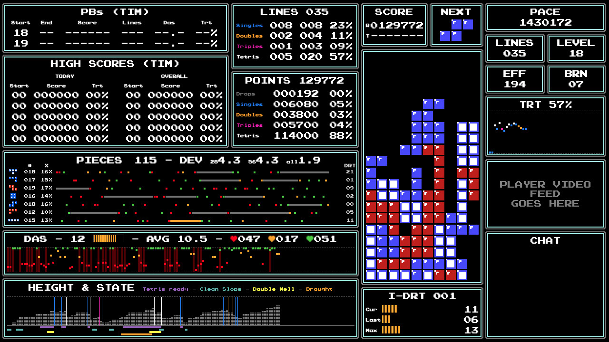
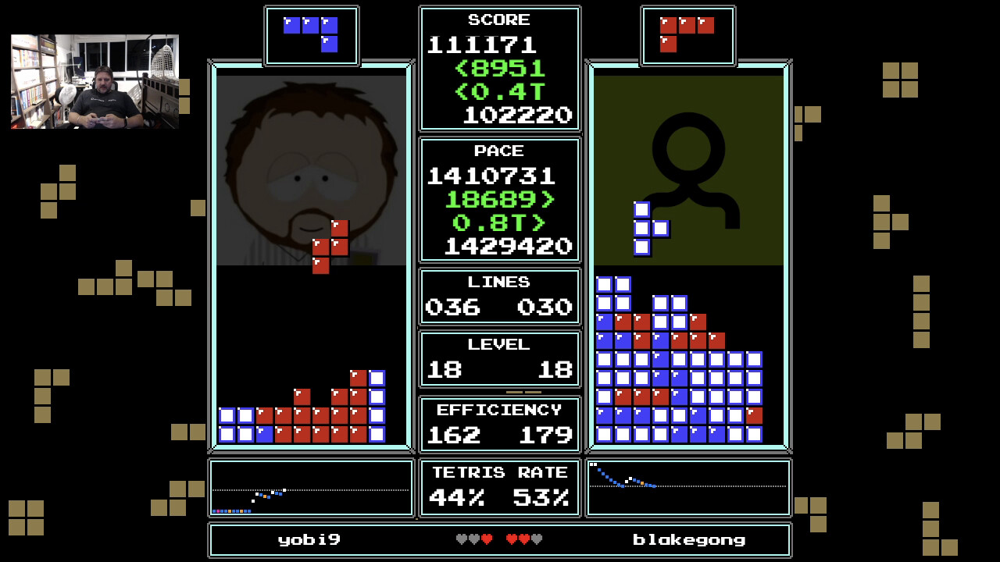
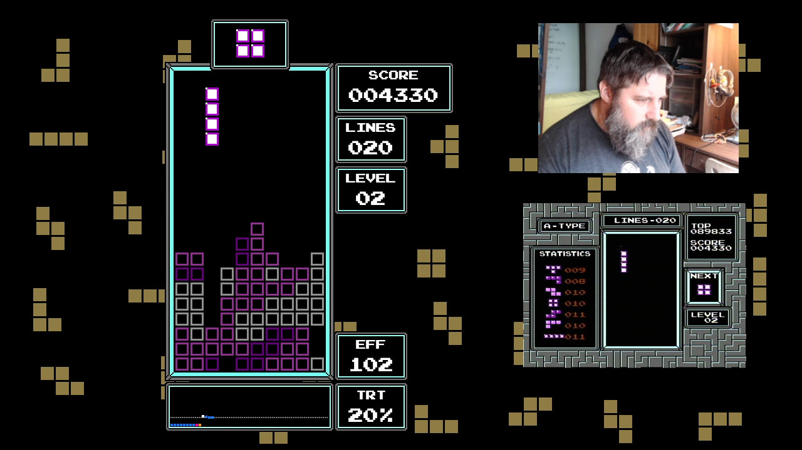

# NESTrisChamps

NESTrisChamps is a browser-based OCR and rendering system for NES classic Tetris.

It is available online under the domain `nestrischamps.herokuapp.com`

NESTrisChamps is composed of 3 main parts:
* A browser Based OCR
	* Supports both capture devices and screen capture
	* Supports 2 roms: Classic Tetris, and [Das Trainer](https://www.romhacking.net/hacks/3761/)
* A Server to which OCR-ed game data is sent, and which rebroadcasts data
* A System of renderers to redraw game play from scratch
	* Crisp, pixel-perfect rendering
	* Many stats computed in real time
		* For reviewing one's own game footage after the fact
		* For audience to understand more about the gamein real time
		* For match commentators to make better commentary in real time


Basically, when we have Tetris game data (as opposed to images), the tetris game can be re-rendered with custom layouts, and various statistics can be computed. When multiple player data are used, a competition UI can be built with score differential and other comparative stats.

NEsTrisChamps provides many renmdering layouts implemented in HTML+CSS+JavaScript at 720p resolution. This allows the templates to be dropped easily in [OBS](https://obsproject.com/) or [StreamLabs](https://streamlabs.com/) as [Browser Sources](https://obsproject.com/wiki/Sources-Guide#browsersource), and then adding player video stream or other sources like Twitch Chat on top of it.

To get started, visit the online docs here:
https://nestrischamps.herokuapp.com/docs


## Sample Screenshots

### Das Trainer Stats Layout



Documentation for sections of that UI is [here](https://github.com/timotheeg/NESTrisStatsUI/blob/master/docs/stats.md)

1 game demo video [here](https://www.youtube.com/watch?v=OhNsuIUrRD0)


### CTJC Competition Layout



Includes score differentials, difference in number of tetrises, tetris rate computation, running tetris rate, and pace.

UI "inspired" from, and improving on, [CTJC's layout](https://www.youtube.com/watch?v=ATpW6TQ_H2c).

1 game demo video [here](https://www.youtube.com/watch?v=0cnpc64fveg)


### Invisible Tetris Renderer



Here's a demo of my playing from the renderer itself (it's harder than it looks because rendering runs 2 frame behind)
* [Game 1](https://www.youtube.com/watch?v=eh2bqVe4wOo)
* [Game 2](https://www.youtube.com/watch?v=6CLdBgV3DW4)

The 2 semi finals and the final match of CTWC 2019's Invisible Tetris Competition have also been rendered with this renderer for demo, as seen from the links below:
* [Semi 1 - Joseph vs Kauser](https://www.youtube.com/watch?v=OXluTMkbGG4)
* [Semi 2 - GreenTea vs Alex](https://www.youtube.com/watch?v=JVHS3EaVAA4)
* [Final - Kauser vs Alex](https://www.youtube.com/watch?v=5nBTSb1zKjc)


## Getting started

NESTrisChamps only works in Chrome and Chromium atm (sorry!). Firefox might come at some point. It is unlikely I will support MS Edge unless someone contribute PRs.

Read [the documentation](https://nestrischamps.herokuapp.com/docs).


### NEStrisChamps online

1. In a window laod your producer page [https://nestrischamps.herokuapp.com/room/producer](https://nestrischamps.herokuapp.com/room/producer)
2. Calibrate your input. If you're lucky the autocalibration would have done a good job, and only needs minor fine tuning. You still **must** fine tune to have the capture areas pixel-perfect (refer to [the OCR section](https://nestrischamps.herokuapp.com/docs/#ocr) for details) of the documentation.
3. Visit your personal renderers page to copy the renderer URL [https://nestrischamps.herokuapp.com/renderers](https://nestrischamps.herokuapp.com/renderers). I recommend using the layout `simple_1p` for a start
4. Start playing the renderer should render your game.

Note: Both pages **must** be in their own windows. The producer cannot be a in background tab, or chrome would throttle its processing, and your capture would be all choppy.

Read this additional [calibration guide](https://docs.google.com/document/d/1W7g536D6hWxRWWMO667dOY1fOm5HaO3XxskNSq7MA-k/edit) created by [aGameScout](https://www.twitch.tv/agamescout).


### OBS

One you have connected your producer and renderer, you are ready to set up OBS or Streamlabs to stream it.

To do that, drop a Browser Source in OBS and use the renderer URL as-is. Make sure the Browser Source is set at 1280x720.

Also, verify that Browser Source hardware acceleration is set (under Advanced Settings).


### Local Setup

Warning: Local setup is for developpers and contributors. If you are a casual user, use [nestrischamps online](https://nestrischamps.herokuapp.com/) instead :)

[](https://github.com/prettier/prettier)


#### Install nodejs

Nestrischamps is a [nodejs](https://nodejs.org/en/) server application and UI. It can run on node 12 and above, but use 14+ if you can. Installation instruction for your OS are left for you to figure out.


#### Clone the project locally from git:
```bash
git clone https://github.com/timotheeg/nestrischamps.git
```

#### Install nodejs dependencies

```bash
cd nestrischamps
npm install
```

#### Set up a postgres local DB

Install a local [Postgres DB](https://www.postgresql.org/) (instruction on how to do that is left to you. Check documentation for your OS), and set it up by running the [sql setup commands](./setup/db.sql).

#### Set up your environment variables

Create a file `.env` at the root of the project checkout folder. The following environment variables are required:

```
DATABASE_URL=postgres://<UNAME>:<PWD>@<HOST>:<PORT>/<DBNAME>
FF_SAVE_GAME_FRAMES=1
```

The variable `DATABASE_URL` should basically contains a [connection URI](https://node-postgres.com/features/connecting#connection-uri), which should match your DB access.

The variable `FF_SAVE_GAME_FRAMES=1` ensures that game files will saved locally (in the folder `games`. For replay if you want, of for further game analysis later if you are so enclined. If you do not want to save grame frames, remove the variable `FF_SAVE_GAME_FRAMES`

#### Install prettier

Prettier is installed when you install nodejs dependencies. To use prettier to format your code, please follow this [guide](https://prettier.io/docs/en/editors.html) to setup prettier with your code editor.

#### Run the server

Sets environment variable and start the server
```bash
npm run start-linux
```

#### Access the App

The app is accessed locally just like the online live version of nestrischamps.

The only thing the local versiopn des not support is Twitch login.

So, load the producer URL: [http://localhost:5000/room/producer](http://localhost:5000/room/producer), and click on the button `Login as Player 1` to set your session.

Next, lLoad the renderer URL: [http://localhost:5000/renderes](http://localhost:5000/renderers), and copy the URL for the layout you want.

Create a Browser source in OBS from that URL (again, just like in nestrischamps online mode).

You're done! From here on, everything should be connected and working!


#### Invite remote friends

If you know how to set up apps on your router (i.e. [port forwarding](https://www.noip.com/support/knowledgebase/general-port-forwarding-guide/), you can invite your friends to play on your local server. Make them access the producer URL, and ask them to login as player 2 rather than player 1.


## "Hidden" options

### Start Timer button

If you use the Stencil renderer to qualify for CTM or other online competitions, to start the timer, load your producer URL with an extra Query String argument like this [https://nestrischamps.herokuapp.com/room/producer?timer=1](https://nestrischamps.herokuapp.com/room/producer?timer=1)


### Don't draw background

Many of the layouts have a black background with drak Yelow pieces drawn on them. If you'd rather have a transparent background, use the query string argument `?bg=0` to disable the background

### Don't use Half Height

Capture devices are presumed to produce interlaced output, which can create incorrect reads. NESTrisChamps by default uses only one line in 2 to remove interlacing deffect. Some capture device have built-in deinterlacer and smoothener which render a slightly blurry output. While this looks great, it's not well suited for the half-height system of NESTrisChamps.

It is possible to disable the half-height behaviour by adding the following query string argument in the producer page `?disable_half_height=1`.


## Contribute

To contribute, make sure you first set project to run locally (see previous sections), such you can test your code before opening up PRs.

Many issues and ideas for improvements are listed in the [github issues](https://github.com/timotheeg/nestrischamps/issues).

The code is sort of messy, and yet, I have some standards hidden in this mess. Until I document them, please ask on [the discord server](https://discord.gg/gaCEe5aX) before submitting PRs.


## References and Equipment

* Capture device: [EasierCap](https://www.amazon.com/Capture-Grabber-Recorder-Adapter-Converter/dp/B00STDO9PM)
* Amplifying Signal splitter: [1x4 Component Video Distribution Amplifier / Splitter](https://www.amazon.com/gp/product/B00CAIBQ9E)


## Related Projects

* [NESTrisOCR](https://github.com/alex-ong/NESTrisOCR)
* [MaxoutClub](https://maxoutclub.com/)
* [Tetris CTM Summary](https://github.com/timotheeg/tetris_ctm_summary)
